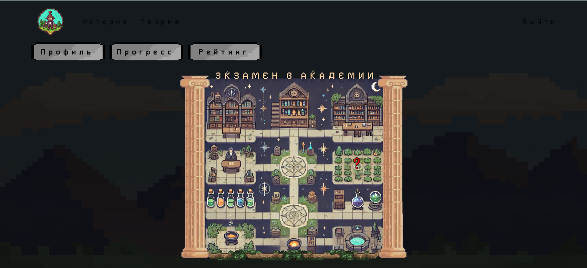

# Клиентская часть образовательной игры **«Приключения алхимика»**

## О проекте

**«Приключения алхимика»** — интерактивная игра по школьной химии для средних классов.

Игрок — молодой алхимик, получивший письмо от великого мастера Химеры и направляющийся в Академию Алхимии. Его ждут тематические приключения: каждый раздел содержит теоретические материалы, обучающие видео и тесты. Игра стимулирует интерес к науке через геймификацию, систему прогресса и рейтинги.

Этот репозиторий содержит **клиентскую часть**. Сервер расположен отдельно.

## Особенности

- Структура: Разделы → Темы → Лекции + Видео + Тест
- Роутинг реализован на `react-router-dom`
- Система рейтинга, прогресса, скачивания материалов
- Реактивный интерфейс с анимациями

## Используемые библиотеки

- React  
- TypeScript  
- React Router DOM   

## Быстрый старт

```bash
git clone https://github.com/ChornyChay1/AlChemy-game.git
cd AlChemy-game
npm install
npm run dev
```
Проект будет доступен по адресу: http://localhost:3000

## 🚏 Доступные роуты

| Путь                   | Описание                          |
|------------------------|-----------------------------------|
| `/`                    | Приветствие                       |
| `/registration`        | Регистрация                       |
| `/enter`               | Вход                              |
| `/letter`              | Получение письма                  |
| `/help`                | Справка                           |
| `/history`             | Книга истории алхимии             |
| `/profile`             | Профиль игрока                    |
| `/rating`              | Таблица рейтингов                 |
| `/theory`              | Общая теория                      |
| `/progress`            | Прогресс игрока                   |
| `/adventure`           | Приключение — список разделов     |
| `/adventure/topic`     | Просмотр темы                     |
| `/adventure/done`      | Завершение приключения            |

---

## Интерфейс

_(Скриншот главного экрана игры)_



---

## 🎞 GIF-демонстрация

_(Краткий обзор игрового процесса)_


---
## Связанный репозиторий

Backend : [Backend.](https://github.com/ChornyChay1/AlChemyGameBackend)   
